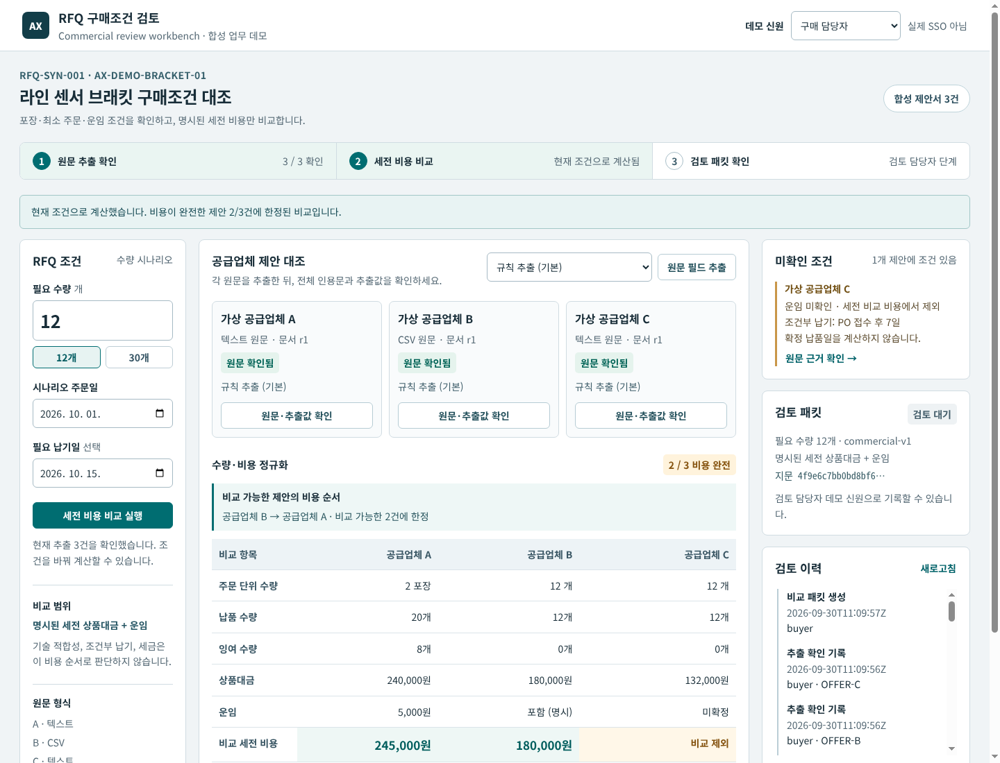
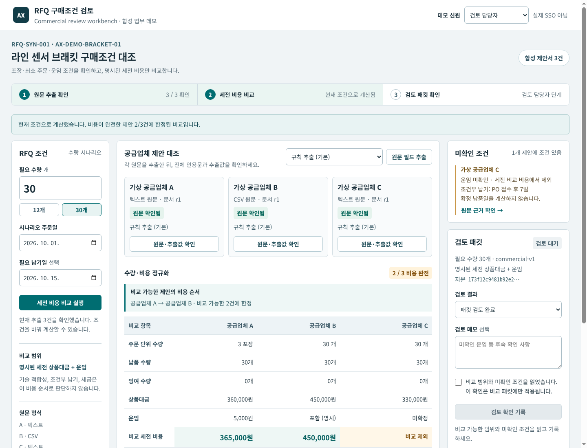

# RFQ Commercial Review Workbench
제조업 구매 담당자가 합성 공급업체 견적의 포장·MOQ·운임 조건을 확인하고, 수요 시나리오별 한정 비용을 검토하는 로컬 업무 데모입니다. 업체 선정·발주·견적 수락을 수행하지 않습니다.

## 업무와 공개 기업 사례
BMW Group Purchasing의 공개 Offer Analyst 사례에서 공급업체 제안 분석·비교 업무를 참고했습니다. 내부 데이터 구조, 알고리즘, ROI를 재현했다는 의미는 아닙니다.
[공식 BMW 발표](https://www.press.bmwgroup.com/global/article/detail/T0450032EN/greater-efficiency-and-productivity-with-artificial-intelligence-%E2%80%93-generative-ai-in-bmw-group-purchasing?language=en)

| 공개 업무 | 자체 재현 기능 | 검증 자료 | 없는 부분 |
|---|---|---|---|
| 공급업체 제안 분석·비교 | 1개 RFQ, 가상 공급업체 3개, 텍스트/CSV 원문 | 원문 해시·행·span, 합성 fixture | 실제 BMW 견적·내부 architecture |
| 구매 분석 지원 | 포장/MOQ/0기준 배수와 수요12→30 비교 | 고정 rule gold15사례 | 기술 자격·법적 조건·업체 선정 |
| 담당자 판단 지원 | 추출 확인과 특정 비교패킷 검토 2단계 | 중복·권한·stale 회귀 | SSO·전자결재·ERP 연동 |

## 작업 흐름
1. 구매 담당자가 원문 행과 제안된 17개 필드를 확인합니다.
2. 담당자가 추출 항목을 확인해야 계산이 가능합니다. 모델 실패 시 규칙 추출을 수동 확인합니다.
3. 서버가 정수/Fraction으로 주문량·잉여·상품·운임을 계산합니다.
4. 검토 담당자가 특정 패킷의 검토 기록을 남깁니다. 구매 승인 버튼은 없습니다.
5. 원문·추출 선택·수량·날짜·산식 버전이 바뀌면 기존 검토는 stale입니다.

[실제 화면12개 및 검증 구분](docs/demo/README.md) · [실제 동작 영상](docs/demo/video/workflow.mp4)

## 비용 계약
KRW 단일 통화이며 명시된 세금 별도 상품+운임만 비교합니다. 세금 포함/미상, 미상 필수 비용, 별도 취급료, 만료 가격, 모호한 MOQ 단위, 원 미만 Fraction은 완전 비교에서 제외됩니다. 미상 운임은 0이 아닙니다.
가격의 기준 개수와 주문 단위/포장 개수는 별개입니다.
~~~text
필요 주문단위 = ceil(수요 / 포장개수)
주문단위 = ceil(max(필요 주문단위, MOQ) / order_multiple) * order_multiple
납품수량 = 주문단위 * 포장개수
잉여 = 납품수량 - 수요
상품비용 = Fraction(납품수량 * 가격, 가격기준개수)
비교비용 = 명시된 세금별도 상품비용 + 운임
~~~
multiple은 0기준 배수이고 가격 유효일은 당일 포함입니다. 조건부 납기 'PO 접수 후 7일'로 ETA를 만들지 않습니다. 납기 상태, 기술 자격, 검토 상태와 비용 순서는 별개입니다.

| 수요 | A | B | C | 한정 비용 순서 |
|---|---:|---:|---|---|
| 12개 | 2pack/20개, 잉여8, 245000원 | 12개, 180000원 | 상품132000원/운임미확정 | B → A, 비교가능2/3 |
| 30개 | 3pack/30개, 365000원 | 30개, 450000원 | 상품330000원/운임미확정 | A → B, 비교가능2/3 |

C를 3등으로 표시하지 않습니다. '최고 업체', '전체 최저가', '총 도착원가', '절감 효과'를 주장하지 않습니다.

## 설치와 실행
Python3.10+ 표준 라이브러리만 필요합니다. 새 GPU 모델 다운로드나 Docker 설치가 필요하지 않습니다.
~~~bash
git clone https://github.com/Kimhyuntae9665/rfq-commercial-review-workbench.git
cd rfq-commercial-review-workbench
python3 -m venv --without-pip .venv
.venv/bin/python -m rfq_review.server --port 19083
~~~
브라우저에서 http://127.0.0.1:19083 을 엽니다. 구매/검토 역할은 서버가 허용한 합성 데모 신원이며 SSO가 아닙니다. SQLite 업무 기록은 로컬 data/rfq.sqlite3에 생성됩니다. 외부 공개 배포용 서비스가 아닙니다.

## 모델과 규칙의 경계
기존 Ollama0.17.7의 qwen3:4b Q4_K_M을 재사용합니다. 모델은 한 문서씩 필드와 원문을 제안하며 계산·세금 추정·누락값 보충·업체 선정은 하지 않습니다. CPU 규칙이 전체 원문 셀·행·해시·필수 필드를 검증한 후 계산합니다.
모델 요청은 localhost, concurrency1, num_ctx4096, num_predict1024, think:false, truncate:false, shift:false입니다. 출력 문법에는 해당 문서의 모든 셀·모든 행 후보를 동일하게 제공하며 필드별 답값이나 gold는 넣지 않습니다. 따라서 자유 형식 견적의 범용 추출 능력을 증명하지 않습니다.
[Qwen 모델](https://ollama.com/library/qwen3:4b), [Qwen3 model card](https://huggingface.co/Qwen/Qwen3-4B-Thinking-2507).
think:false 요청과 thinking-off 검증은 다릅니다. 설치 템플릿의 자유 출력 thinking 동작은 해결됐다고 주장하지 않습니다.
[공유 GPU/timeout 복구 정책](docs/inference-policy.md)

## 검증
~~~bash
python3 -m unittest discover -s tests -v
python3 scripts/evaluate_frozen.py
node --check static/app.js
~~~
69개 공학 테스트(최종18.761초)와 모델 입력 전에 고정한 15개 합성 rule 사례는 별도 분모입니다. 공학 테스트에는 모델 mock·HTTP·권한·중복·stale·단위·Fraction·lease 정책이 포함됩니다. 실제 최종 모델3문서/3통과, 실행API재검증3문서/3통과이며 같은 문서를 재사용했습니다. 앞선 실패3건도 보존했습니다. 실제 모델 검증과 브라우저 검사는 [evaluation manifest](docs/evaluation.md)에 따로 기록합니다. 이 숫자를 합친 종합 정확도는 없습니다.
gold는 evaluations에 있으며 runtime 코드는 가져오지 않습니다. 전문가 검증 자료나 산업 heldout이 아닙니다.

## 아키텍처와 한계
vanilla HTML/CSS/JS → loopback stdlib HTTP → 원문/추출/확인 SQLite → 정확 계산 → 검토/audit. 모델은 공유 OS lease를 통해 localhost Ollama에만 접근합니다. 임의 shell·Docker socket·구매 write tool을 모델에 제공하지 않습니다.
[아키텍처](docs/architecture.md) · [실행/복구](docs/runbook.md) · [실패 기록](docs/failurelog.md) · [복사 출처](docs/reuse.md)
합성 1품목/3견적, 정해진 key/value 텍스트와 CSV만 지원합니다. PDF/OCR·복수 통화·세율·가격 할인 구간·범위 MOQ·실제 공급업체 검증·SSO·법적 적합성은 범위 밖입니다. UI 대비 표본/화면 재배치는 전체 WCAG 검증이 아닙니다.
향후에는 독립 새 견적 heldout, OCR 원문 span, 승인된 통화/세금 계약, 읽기전용 외부 수집 adapter를 검토합니다. n8n은 설치·활성화하지 않았으며 다른 작성자의 템플릿 JSON을 재배포하지 않습니다.

## 라이선스와 데이터
자체 코드/합성 자료는 MIT입니다. Ollama와 Qwen은 각 upstream 라이선스를 따릅니다. 기업 문서·사진·상표 디자인·커뮤니티 workflow JSON은 포함하지 않았습니다. 실제 기업 견적/개인정보는 없습니다.
