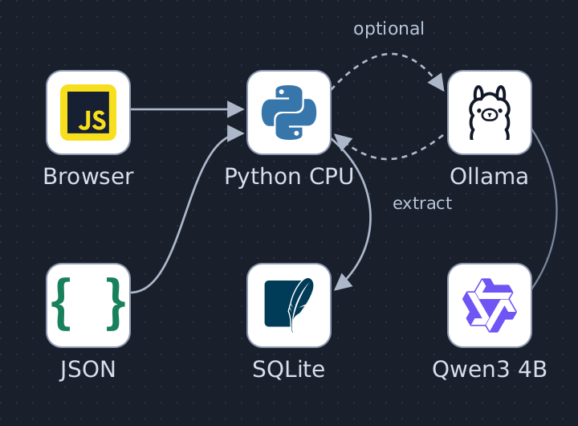
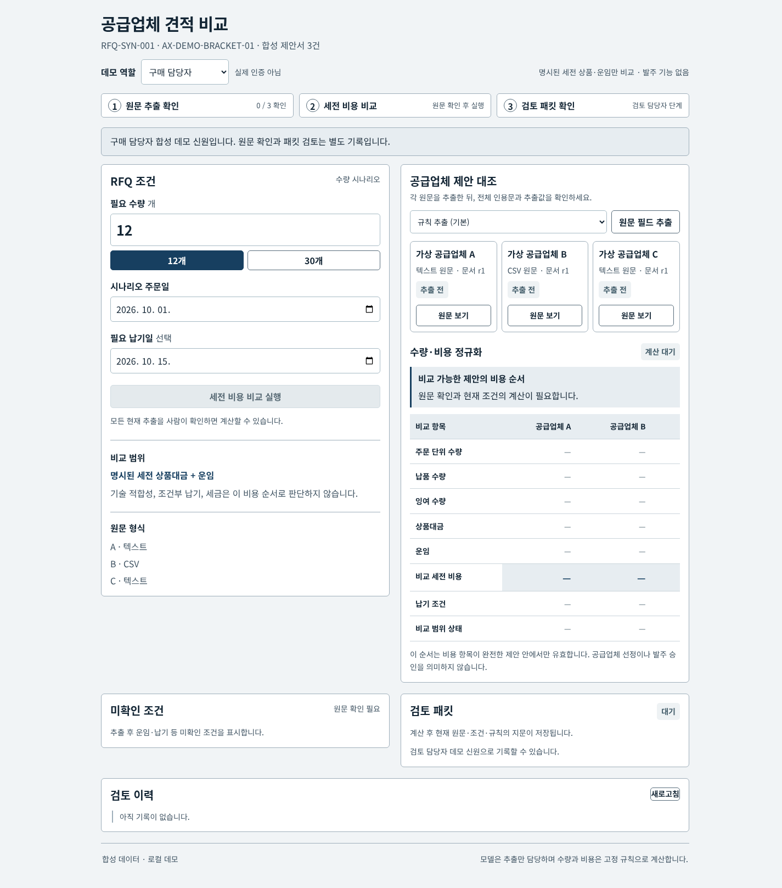
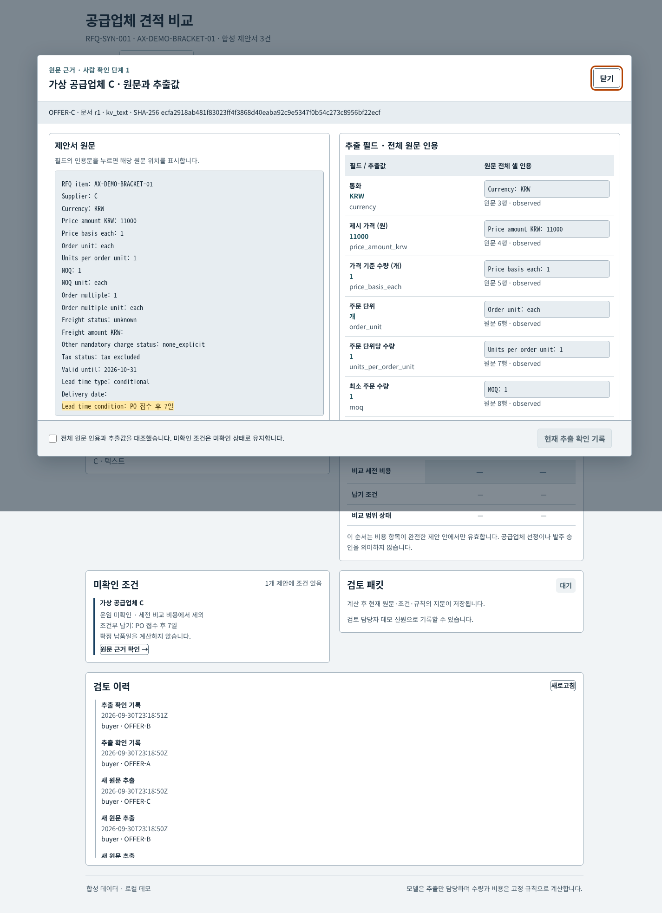
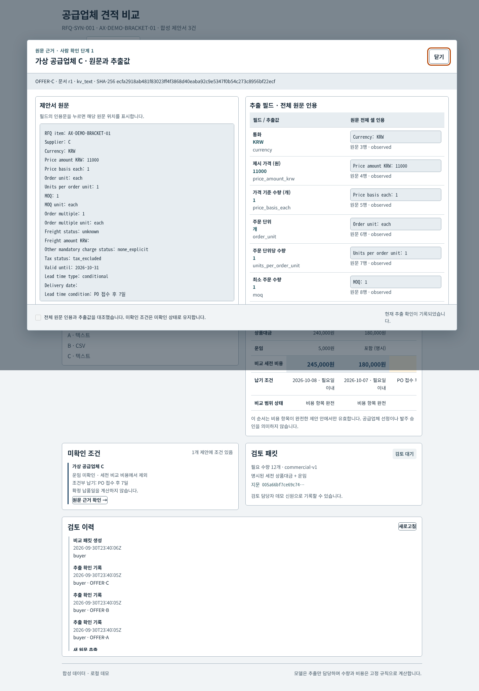
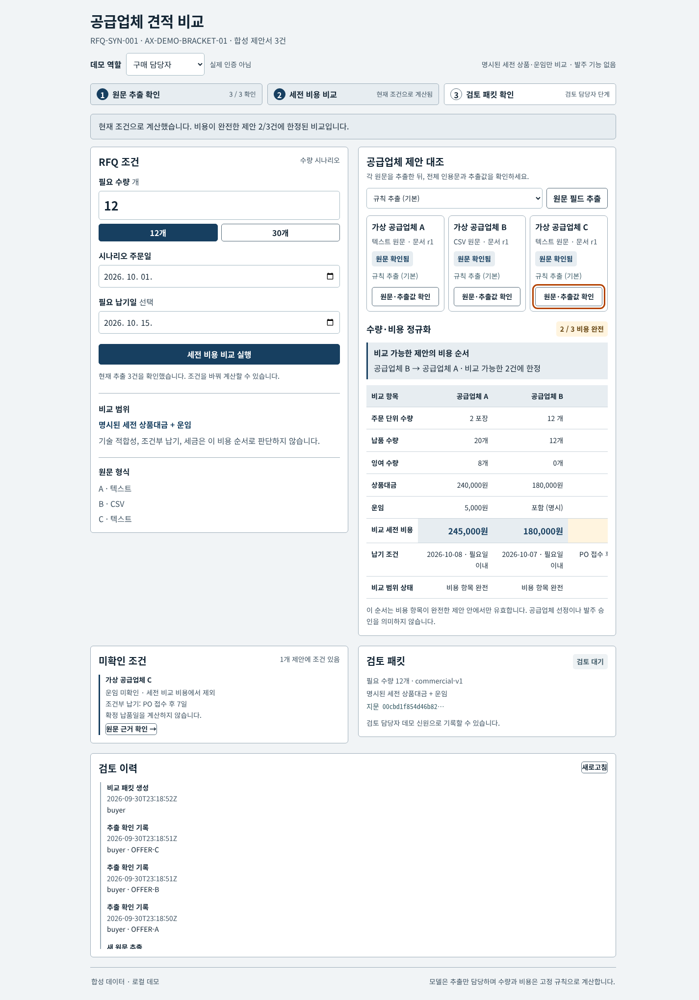
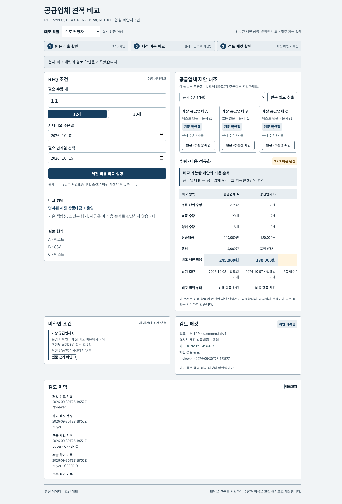
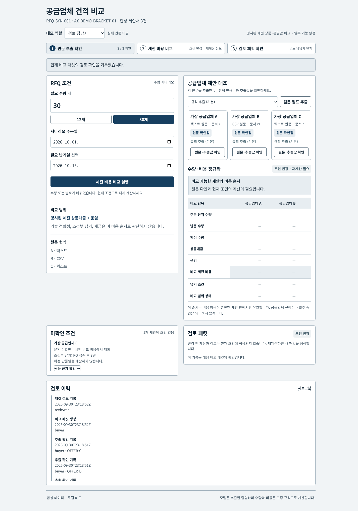
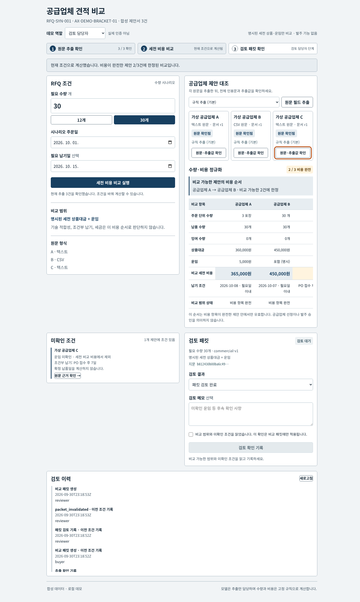
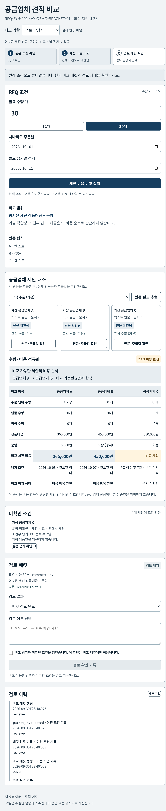
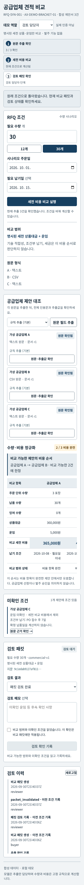

# RFQ Commercial Review Workbench

[Editable SVG](docs/architecture.svg) · [Architecture provenance](docs/architecture-provenance.md)

Browser input and frozen JSON examples feed Python source validation. Human terms confirmation precedes Fraction cost calculation; a separate packet review and audit persist in SQLite. Ollama/Qwen extraction is optional and serial.

제조업 구매 담당자가 합성 공급업체 견적의 포장·MOQ·운임 조건을 확인하고, 수요 시나리오별 한정 비용을 검토하는 로컬 업무 데모입니다. 업체 선정·발주·견적 수락을 수행하지 않습니다.

## 업무와 공개 기업 사례
BMW Group Purchasing의 공개 Offer Analyst 사례에서 공급업체 제안 분석·비교 업무를 참고했습니다. 내부 데이터 구조, 알고리즘, ROI를 재현했다는 의미는 아닙니다.
[공식 BMW 발표](https://www.press.bmwgroup.com/global/article/detail/T0450032EN/greater-efficiency-and-productivity-with-artificial-intelligence-%E2%80%93-generative-ai-in-bmw-group-purchasing?language=en)

| 공개 업무 | 자체 재현 기능 | 검증 자료 | 없는 부분 |
|---|---|---|---|
| 공급업체 제안 분석·비교 | 1개 RFQ, 가상 공급업체 3개 + 새 공급업체 최대 5개, 지원 형식 원문 입력 | 원문 해시·행·span, 합성 fixture와 독립 새 입력 회귀 | 실제 BMW 견적·내부 architecture |
| 구매 분석 지원 | 포장/MOQ/0기준 배수와 수요12→30 비교 | 고정 rule gold15사례 | 기술 자격·법적 조건·업체 선정 |
| 담당자 판단 지원 | 추출 확인과 특정 비교패킷 검토 2단계 | 중복·권한·stale 회귀 | SSO·전자결재·ERP 연동 |

## 작업 흐름
1. 구매 담당자가 원문 행과 제안된 17개 필드를 확인합니다.
2. 담당자가 추출 항목을 확인해야 계산이 가능합니다. 모델 실패 시 규칙 추출을 수동 확인합니다.
3. 서버가 정수/Fraction으로 주문량·잉여·상품·운임을 계산합니다.
4. 검토 담당자가 특정 패킷의 검토 기록을 남깁니다. 구매 승인 버튼은 없습니다.
5. 원문·추출 선택·수량·날짜·산식 버전이 바뀌면 기존 검토는 stale입니다.

### 새 원문 입력 (CPU 기본)

기존에는 `data/offers.json`의 A/B/C만 화면에서 사용할 수 있었습니다. 이제 구매 담당자가 **새 견적 원문 추가**를 열고 붙여넣거나 `.txt` 파일을 선택해 새 공급업체를 추가할 수 있습니다. 고정 예제는 유지하며 새 원문은 SQLite `custom_offers`에 별도로 저장합니다. 파일 선택은 입력란에 읽는 단계이며 **새 원문 저장**을 눌러야 저장됩니다.

파일 원문은 UTF-8을 엄격히 디코딩하고 줄바꿈(CRLF 포함)을 보존합니다. 원문 입력란을 편집하기 전에는 파일 바이트와 같은 SHA-256을 기록합니다. 표시 공급업체명만 바꾸어도 원문은 보존됩니다. 원문 입력란을 편집하면 수정한 텍스트의 지문을 기록하며 **원본 파일의 지문이 아닙니다**. 예제 넣기·초기화는 이전 파일 원문을 버리고, UTF-8 디코딩 실패 시에도 이전 원문을 재사용하지 않습니다. 저장된 원문을 편집 없이 새 버전으로 저장할 때도 원래 줄바꿈을 보존합니다.

1. **합성 예제 넣기**로 지원 형식을 확인하고 가격·포장·MOQ·운임을 수정합니다. Supplier는 `NEW-D` 같은 별도 ID를 사용합니다.
2. **새 원문 저장** 후 열리는 읽기 전용 원문 창에서 **현재 원문 추출**을 누릅니다. 기본 규칙 추출은 모델이나 GPU 없이 실행됩니다.
3. 전체 원문 인용·추출값을 대조하고 체크한 뒤 **현재 추출 확인 기록**을 누릅니다. 다른 현재 제안도 모두 확인해야 계산할 수 있습니다.
4. 수요를 입력하고 비교합니다. 표에는 A/B/C와 새 제안이 함께 표시됩니다. UI 합성 예제 D는 수요 12개에서 4pack/24개, 잉여12개, 상품360,000원 + 운임7,000원 = **367,000원**입니다.
5. 입력 카드의 **입력 원문 새 버전**으로 수정하면 현재 해시를 대조합니다. 이전 추출·확인·비교·검토는 무효화되어 다시 추출하고 확인·계산해야 합니다. 저장된 새 원문은 서버 재시작 후에도 유지됩니다.

지원 계약은 **BOM 없는 UTF-8 `key: value` 텍스트**, 최대 12,000바이트, 아래와 같은 정확히 19개 행입니다. 행 순서는 바꿀 수 있지만 누락·중복·추가 행·빈 행·제어 문자는 거절합니다. 필드 값은 최대 500자, 화면 표시 공급업체명은 80자입니다. `RFQ item`은 현재 품목과 같아야 하고 `Supplier`는 `NEW-` 뒤 대문자·숫자·밑줄·하이픈 1~32자입니다. 공급업체 ID는 수정할 수 없으며 새 공급업체는 최대 5개입니다. A/B/C를 입력 경로로 교체할 수 없습니다.

~~~text
RFQ item: AX-DEMO-BRACKET-01
Supplier: NEW-D
Currency: KRW
Price amount KRW: 90000
Price basis each: 6
Order unit: pack
Units per order unit: 6
MOQ: 3
MOQ unit: pack
Order multiple: 2
Order multiple unit: pack
Freight status: fixed_per_order
Freight amount KRW: 7000
Other mandatory charge status: none_explicit
Tax status: tax_excluded
Valid until: 2026-10-31
Lead time type: absolute_date
Delivery date: 2026-10-09
Lead time condition:
~~~

수량·가격은 1 이상의 정수(최대 30자리), 운임은 0 이상의 정수입니다. `each`는 포장개수 1, MOQ/배수 단위는 주문 단위와 같아야 합니다. 운임 상태는 `included`/`fixed_per_order`/`unknown`이며 고정 운임에는 금액이 필요합니다. 포함·미확인 운임의 금액은 빈 값 또는 0만 허용하지만 **unknown의 0을 실제 운임 0으로 계산하지 않습니다**. 기타 비용은 `none_explicit`/`unknown`, 세금은 `tax_excluded`/`tax_included`/`unknown`을 받으며 미확인 또는 세금 포함 제안은 비용 순서에서 제외됩니다. 날짜는 유효한 `YYYY-MM-DD`입니다. 납기는 `absolute_date`와 납품일, `conditional`과 조건문, 또는 빈 유형/납품일을 받습니다.

`POST /api/rfqs/{rfq_id}/sources`는 구매 역할만 사용할 수 있습니다. JSON 키는 `supplier_label`, `content`, `offer_id`, `expected_source_hash`, `expected_document_revision`이며 생성 시 뒤의 세 값은 `null`, 수정 시 현재 ID·SHA-256·문서 버전입니다. 같은 내용의 새 버전도 이전 버전으로 덮어쓸 수 없습니다. 저장은 추출 확인을 생성하지 않으며 기존 확인을 새 원문에 재사용하지 않습니다. API 출력과 원문·회사명은 화면에 문자로 렌더링합니다. 데모 역할은 실제 인증이 아니므로 민감한 기업 원문을 넣는 운영 서비스로 사용하지 마세요.

### 고정 예제 화면 · P09 v2 스타일

아래 9장은 새 원문 입력 기능 추가 전 합성 데이터와 **규칙 추출**로 실제 Chrome에서 재현한 업무 상태입니다. 새 입력 화면의 검증 증거와 구분합니다. 모델 추출 결과는 아래의 과거 화면 기록과 [평가 문서](docs/evaluation.md)에 별도로 남겨 둡니다.

| 단계 | 실제 화면 |
|---|---|
| RFQ·역할·수량 선택 |  |
| 전체 인용문 확인 |  |
| C 운임 미확정 근거 |  |
| 수요 12개 비교 |  |
| 사람의 검토 기록 |  |
| 수량 변경 시 검토 무효화 |  |
| 수요 30개 순서 역전 |  |
| 200% 상당 화면 폭 |  |
| 모바일 390px |  |

[현재 영상: 실제 브라우저 프레임 순서](docs/demo/refit/video/workflow.mp4) · [캡처·해시·검사 내역](docs/demo/refit/README.md) · [이전 UI의 모델 실측 화면과 영상](docs/demo/README.md) — **과거 레이아웃**

## 비용 계약
KRW 단일 통화이며 명시된 세금 별도 상품+운임만 비교합니다. 세금 포함/미상, 미상 필수 비용, 별도 취급료, 만료 가격, 모호한 MOQ 단위, 원 미만 Fraction은 완전 비교에서 제외됩니다. 미상 운임은 0이 아닙니다.
가격의 기준 개수와 주문 단위/포장 개수는 별개입니다.
~~~text
필요 주문단위 = ceil(수요 / 포장개수)
주문단위 = ceil(max(필요 주문단위, MOQ) / order_multiple) * order_multiple
납품수량 = 주문단위 * 포장개수
잉여 = 납품수량 - 수요
상품비용 = Fraction(납품수량 * 가격, 가격기준개수)
비교비용 = 명시된 세금별도 상품비용 + 운임
~~~
multiple은 0기준 배수이고 가격 유효일은 당일 포함입니다. 조건부 납기 'PO 접수 후 7일'로 ETA를 만들지 않습니다. 납기 상태, 기술 자격, 검토 상태와 비용 순서는 별개입니다.

| 수요 | A | B | C | 한정 비용 순서 |
|---|---:|---:|---|---|
| 12개 | 2pack/20개, 잉여8, 245000원 | 12개, 180000원 | 상품132000원/운임미확정 | B → A, 비교가능2/3 |
| 30개 | 3pack/30개, 365000원 | 30개, 450000원 | 상품330000원/운임미확정 | A → B, 비교가능2/3 |

C를 3등으로 표시하지 않습니다. '최고 업체', '전체 최저가', '총 도착원가', '절감 효과'를 주장하지 않습니다.

## 설치와 실행
Python3.10+ 표준 라이브러리만 필요합니다. 새 GPU 모델 다운로드나 Docker 설치가 필요하지 않습니다.
~~~bash
git clone https://github.com/Kimhyuntae9665/rfq-commercial-review-workbench.git
cd rfq-commercial-review-workbench
python3 -m venv --without-pip .venv
.venv/bin/python -m rfq_review.server --port 19083
~~~
브라우저에서 http://127.0.0.1:19083 을 엽니다. 구매/검토 역할은 서버가 허용한 합성 데모 신원이며 SSO가 아닙니다. SQLite 업무 기록은 로컬 data/rfq.sqlite3에 생성됩니다. 외부 공개 배포용 서비스가 아닙니다.

## 모델과 규칙의 경계
기존 Ollama0.17.7의 qwen3:4b Q4_K_M을 재사용합니다. 모델은 한 문서씩 필드와 원문을 제안하며 계산·세금 추정·누락값 보충·업체 선정은 하지 않습니다. CPU 규칙이 전체 원문 셀·행·해시·필수 필드를 검증한 후 계산합니다.
모델 요청은 localhost, concurrency1, num_ctx4096, num_predict1024, think:false, truncate:false, shift:false입니다. 출력 문법에는 해당 문서의 모든 셀·모든 행 후보를 동일하게 제공하며 필드별 답값이나 gold는 넣지 않습니다. 따라서 자유 형식 견적의 범용 추출 능력을 증명하지 않습니다.
[Qwen 모델](https://ollama.com/library/qwen3:4b), [Qwen3 model card](https://huggingface.co/Qwen/Qwen3-4B-Thinking-2507).
think:false 요청과 thinking-off 검증은 다릅니다. 설치 템플릿의 자유 출력 thinking 동작은 해결됐다고 주장하지 않습니다.
[공유 GPU/timeout 복구 정책](docs/inference-policy.md)

## 검증
~~~bash
python3 -m unittest discover -s tests -v
python3 scripts/evaluate_frozen.py
node --check static/app.js
~~~
69개 공학 테스트(최종18.761초)와 모델 입력 전에 고정한 15개 합성 rule 사례는 별도 분모입니다. 공학 테스트에는 모델 mock·HTTP·권한·중복·stale·단위·Fraction·lease 정책이 포함됩니다. 실제 최종 모델3문서/3통과, 실행API재검증3문서/3통과이며 같은 문서를 재사용했습니다. 앞선 실패3건도 보존했습니다. 실제 모델 검증과 브라우저 검사는 [evaluation manifest](docs/evaluation.md)에 따로 기록합니다. 이 숫자를 합친 종합 정확도는 없습니다.
gold는 evaluations에 있으며 runtime 코드는 가져오지 않습니다. 전문가 검증 자료나 산업 heldout이 아닙니다.

새 입력 추가 후 Windows CPU 검증(2026-10-01): source 9 + core 17 + HTTP 9 + domain 29 = **64개 통과**, frozen rule **15/15**(모델 요청 0), `node --check static/app.js` 통과. 새 입력 테스트는 별도 7개 포장·MOQ·배수·운임 값으로 342,500원을 검증하고 저장/재시작, 미확인 운임, 권한, 크기·형식 거절, 수정·stale 해시, 동시 저장·동일 내용의 버전 충돌, 모델 mock 중 원문 변경을 검사합니다. CRLF 원문의 바이트 해시·인용 위치를 확인하며 Node 폼 핸들러 검사 6개 시나리오는 textarea 줄바꿈 정규화, 표시명 변경, 실제 편집, 예제/초기화, 저장된 버전, 잘못된 UTF-8 파일을 검사합니다. Node 검사는 실제 브라우저 업로드 검사와 구분합니다. 위의 과거 69개/실제 모델 실측과 분모를 합치지 않습니다. 현재 Windows의 전체 테스트 발견은 기존 `test_llm.py`의 Unix `fcntl` import로 막힙니다. 모델 추출은 이번 변경에서 실행하지 않았으며 CPU 경로는 이 의존성을 가져오지 않습니다.

~~~powershell
python -X utf8 -m unittest discover -s tests -p "test_[cdhs]*.py" -v
python -X utf8 scripts/evaluate_frozen.py
node --check static/app.js
node tests/test_source_buffer.js
~~~

## 아키텍처와 한계
vanilla HTML/CSS/JS → loopback stdlib HTTP → 원문/추출/확인 SQLite → 정확 계산 → 검토/audit. 모델은 공유 OS lease를 통해 localhost Ollama에만 접근합니다. 임의 shell·Docker socket·구매 write tool을 모델에 제공하지 않습니다.
[아키텍처](docs/architecture.md) · [실행/복구](docs/runbook.md) · [실패 기록](docs/failurelog.md) · [복사 출처](docs/reuse.md)
1품목/고정 예제 3견적 + 새 공급업체 최대 5개입니다. 고정 원문은 정해진 key/value 텍스트와 CSV, 새 입력은 위 계약의 텍스트만 지원합니다. 임의 문서를 그대로 이해하는 기능이나 새 입력에 대한 모델 정확도 증거는 아닙니다. PDF/OCR·새 CSV 업로드·복수 품목·통화·세율·가격 할인 구간·범위 MOQ·실제 공급업체 검증·SSO·법적 적합성은 범위 밖입니다. 새 원문 삭제 UI는 없으며 초기화하려면 서버를 멈추고 별도 데모 DB로 시작합니다. UI 대비 표본/화면 재배치는 전체 WCAG 검증이 아닙니다.
향후에는 독립 새 견적 heldout, OCR 원문 span, 승인된 통화/세금 계약, 읽기전용 외부 수집 adapter를 검토합니다. n8n은 설치·활성화하지 않았으며 다른 작성자의 템플릿 JSON을 재배포하지 않습니다.

## 라이선스와 데이터
자체 코드/합성 자료는 MIT입니다. Ollama와 Qwen은 각 upstream 라이선스를 따릅니다. 기업 문서·사진·상표 디자인·커뮤니티 workflow JSON은 포함하지 않았습니다. 실제 기업 견적/개인정보는 없습니다.
