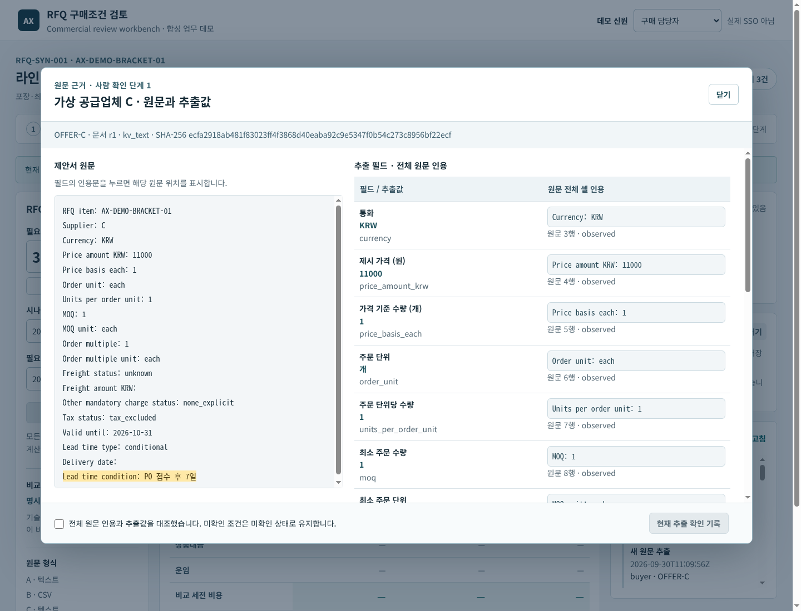
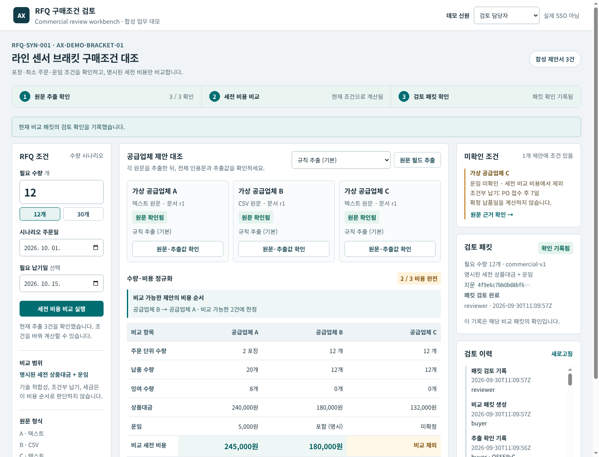
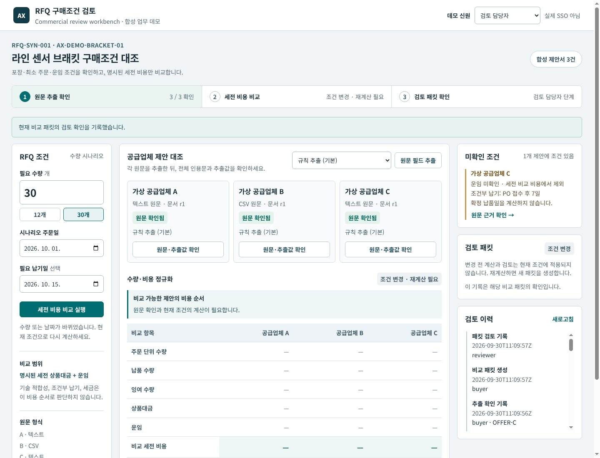
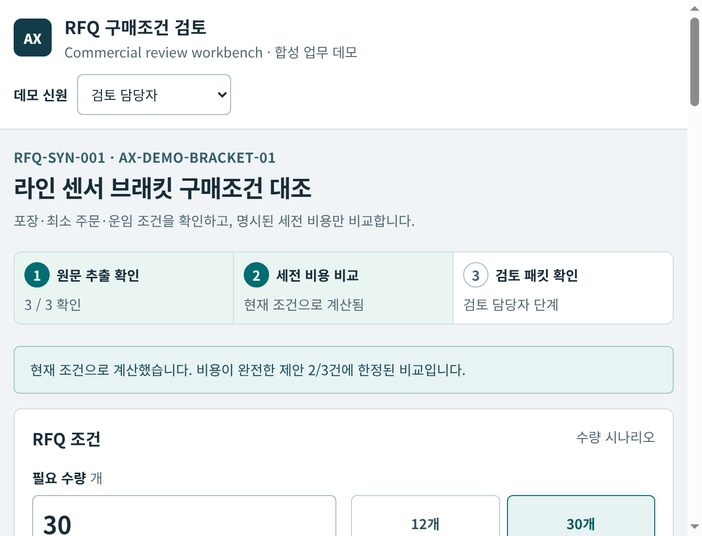
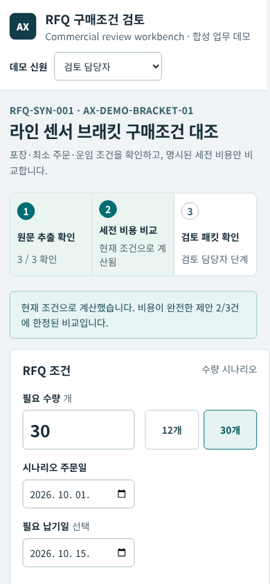
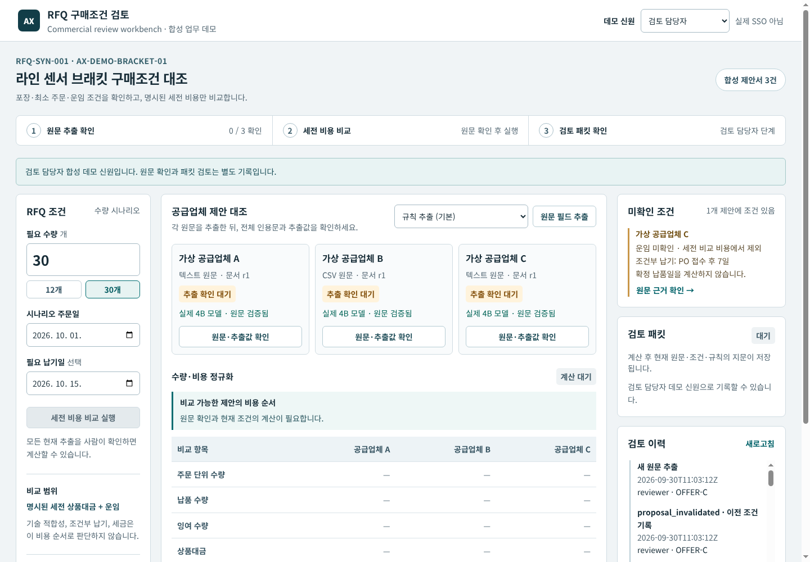
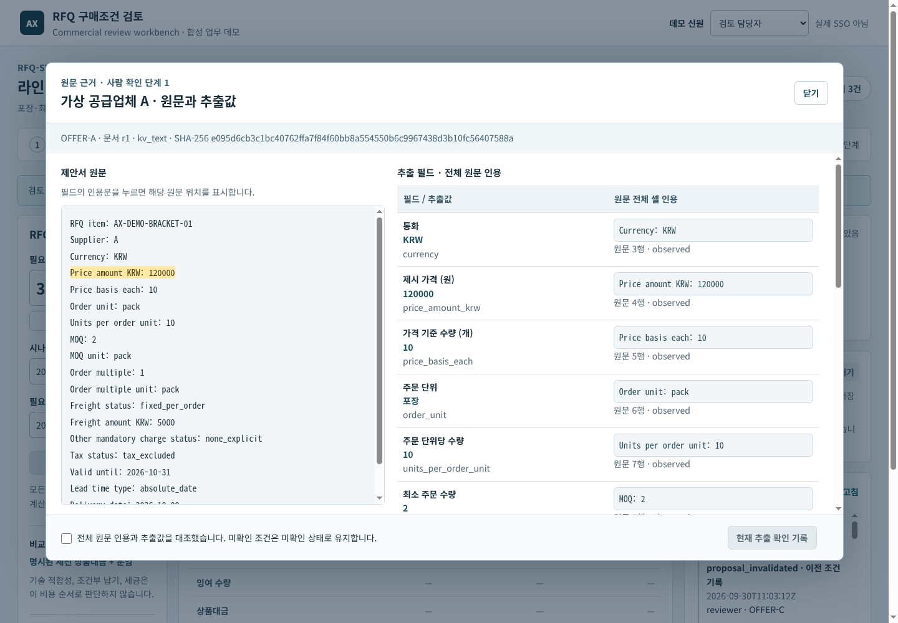
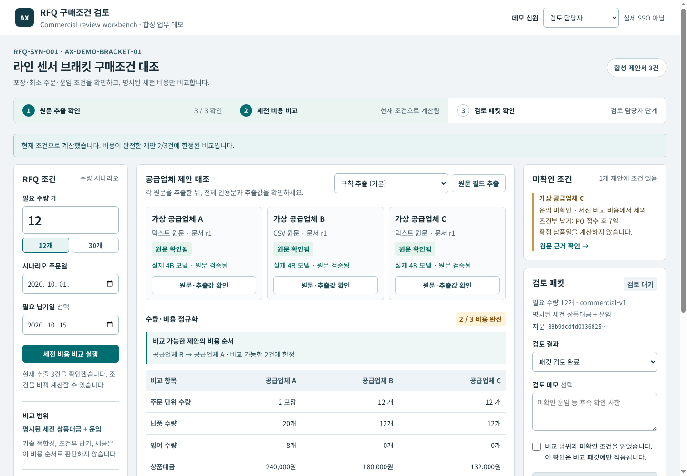
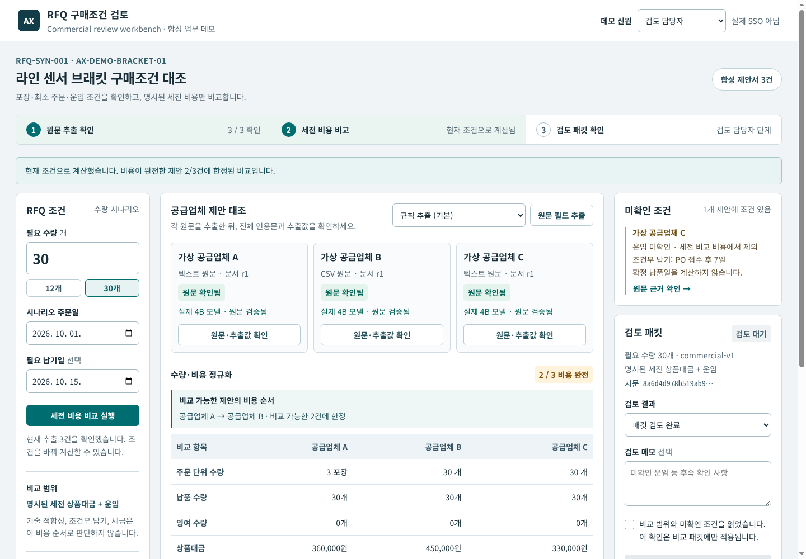
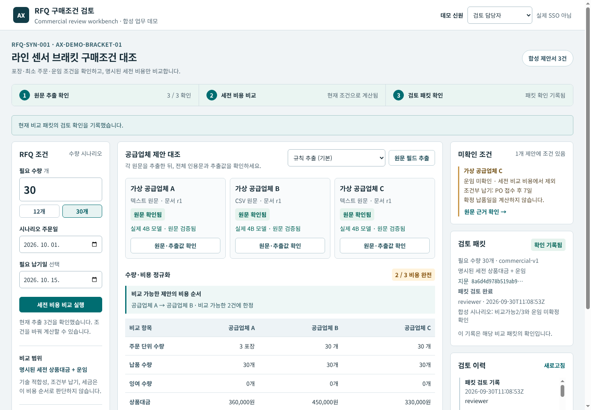

# Actual UI gallery
01–07 are actual browser captures using deterministic baseline extraction. Browser hostile-markup/large-integer/longlabel assertions use explicit temporary display-state mocks; those assertions are not screenshots of successful live inference.
08–12 are actual GET displays of three stored qwen3:4b API proposals which passed full-cell source validation. Source confirmation, cost12→30 and packet acknowledgement were performed by an automated synthetic demo script. Recording made0modelrequests; earlier API extraction made3 sequential requests.
No images were composited, success text edited, or private account/PC/SSH information included. Viewports contain only synthetic demo identities and synthetic source data.

| Image | State |
|---|---|
|  | Baseline full quote |
|  | B→A, Cexcluded |
|  | Specific baseline packet ack |
|  | Dirty scenario needs recalculation |
|  | A→B, fixedcolumns |
|  | 200%-equivalent CSSreflow |
|  | Narrowviewport |
|  | Stored actual3modelproposals |
|  | Actual source quote highlight |
|  | Confirmed actualmodel terms, CPUcost |
|  | CPUscenario reversal |
|  | Synthetic demo packet ack |

[Actual workflow video](video/workflow.mp4). Silent1440×1000 H264.27 original native JPEG viewport frames with captured monotonic timing; ffmpeg resamples to30fps and repeats holds. This is a browser-frame sequence, not an unbroken screen recording. Native frames and manifest are retained. No additional success overlays were added.
